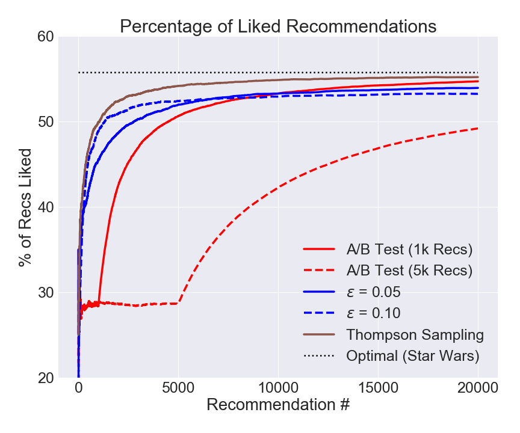

# No Regrets
*A deep dive comparison of bandits and A/B testing*

##### Table of Contents
- [Background and Introduction](#background-and-introduction)
	- [A/B Tests](#ab-tests)
	- [Bandit Algorithms](#bandit-algorithms)
- [Finding the Best Movie](#finding-the-best-movie)
	- [Replay for Online Tests](#replay-for-online-tests)
	- [Movie Ratings Data](#movie-ratings-data)
- [Results](#results)
	- [Bandit Simulation Results](#bandit-simulation-results)
	- [Overall Results](#overall-results)
- [Summary](#summary)

## Background and Introduction
### A/B Tests
A standard approach for evaluating select variants in an online setting is A/B testing. As the name implies, the technique is an experiment to determine the performance of two options, "A" and "B." These could be ad banners or webpage formatting styles, for example. Option "A" generally represents what is currently in use and acts as a control to compare to choice "B." In a real setting, any number of alternative options can be tested at the same time.

During the test, each variant is presented to an equal number of users to **explore** its performance. After the test concludes, the best option is identified and used exclusively, **exploiting** the knowledge that was gained from the test.

  

One drawback with A/B testing is that it incurs "**regret**," which is the concept that during the test, inferior options were presented to some users who may have had a better interaction with a better choice. For example, imagine performing an A/B test that compares different ad banners and finds that one banner leads to more conversions than the others. In this context, regret refers to the loss of conversions of users that did not click on the inferior ad that they were shown, who would have clicked on the best ad if it had been presented to them.

With regular use of A/B testing, regret quietly affects a company’s bottom line over time, through things like lost conversions or less-than-ideal user experiences. For any company that regularly runs tests to find an optimal version, minimizing regret as much as possible could provide a significant advantage.

### Bandit Algorithms
Bandit algorithms can reduce the amount of regret that occurs with A/B tests because they continuously balance exploration with exploitation. After every new sample, the knowledge that was learned is used to make a better choice the next time around. Over time, the options that perform better are used more often than the underperformers, and eventually the best option wins out.

  

How this balance of exploration and exploitation is achieved depends on the particular bandit algorithm. One of the first bandit algorithms ever developed is the &epsilon;-Greedy algorithm, which uses a parameter ("&epsilon;") to control the percentage of time that a random option is selected &mdash; corresponding to exploration. The remainder of the time, the option that has historically performed the best is used &mdash; corresponding to exploitation.

Another bandit is the Thompson Sampling algorithm. It treats each tested option as having an intrinsic probability of resulting in a positive user interaction. To make a selection for a user, each option's probability distribution is sampled and the one with the highest probability of having a positive interaction is used. After observing the response, the estimate of that option’s probability distribution is updated for the next selection.

There are other bandit algorithms as well, such as the Softmax algorithm, which can be used to minimize negative interactions, at the cost of using the best option less often. Choosing which bandit algorithm to use depends on what is being tested and the priorities of the tester.

## Finding the Best Movie
Common uses of bandit algorithms include selecting the best ad banners to display and providing news article suggestions. In principle, however, bandits can be used in any situation where there are a number of choices that each have a different rate of positive user interaction.

When a person watches a movie, she might enjoy the experience or she might not. From this viewpoint, bandit algorithms can be used to identify the "best" movie out of a collection of movies. In this scenario, the algorithm will make a recommendation to a potential viewer, and if the person watched and enjoyed the movie, that would be a positive interaction.

### Replay for Online Tests
Bandit algorithms are generally used online, but their performance can be evaluated through simulations with historical data using a technique known as the "replayer" method. This works by simulating which option the algorithm would select for a viewer, and if there is a historical record of the viewer's interaction with that option, the result &mdash; whether the experience was positive or negative &mdash; is counted as if it had happened. If there is no historical record of that interaction, it is ignored. Using the replayer method, bandit algorithms can be evaluated on a historical dataset of movie ratings. 

### Movie Ratings Data
The MovieLens 100K dataset contains 943 users and their ratings for 1,682 movies. The ratings are on a scale from 1 (worst) to 5 (best). To translate this discrete range into a simple positive or negative experience for the viewer, a rating threshold can be chosen to delineate whether the viewer "liked" or "disliked" the movie. Since a rating of 5 is the best, and clearly those who gave that rating liked the movie, it is a straightforward choice for the threshold. In this demonstration, if a viewer gave a movie a rating of 5, the user "liked" the movie, otherwise the user "disliked" the movie.

The movies in the dataset do not have the same number of ratings. As a consequence, a longer simulation would be needed to identify the best movie, given the constraints of the replayer method. In the interests of having a denser dataset, the simulations can be limited to the ten movies with the most ratings. These movies are summarized in the following figure, which shows the probability &mdash; based on the historical data &mdash; that a viewer liked the movie and gave it a rating of 5.

  

For example, the original *Star Wars* movie was liked by more than 50% of the viewers who rated it, whereas *Liar Liar* was liked by less than 10%. If the bandit simulation works correctly, it should determine that *Star Wars* is the best movie in the set.

## Results
### Bandit Simulation Results
As discussed earlier, bandit algorithms dynamically balance exploration and exploitation. They start out using all possible options, but continuously shift towards choosing the better options more often until one prevails as the best.

The following figure summarizes the first 1,000 recommendations made during a single simulation of a Thompson Sampling bandit on the movie dataset. The figure shows each movie's percentage of the total recommendations made on the vertical axis, as a function of how many recommendations the algorithm made at that moment on the horizontal axis.

  

In the beginning of the simulation, all options are being explored, but over time the best one emerges. Of the first 250 recommendations:
- 27 (~11%) were *Toy Story*
- 91 (~36%) were *Star Wars*
- 63 (~25%) were *Fargo*

After 500 recommendations, *Star Wars* has already accounted for more than 50% of all of the recommendations made by the algorithm; after 1,000 recommendations, its share has surpassed 70%.

### Overall Results
The simulation results for 20,000 recommendations made by three different algorithms (Thompson Sampling, &epsilon;-Greedy and A/B tests) are compared in the following figure. The percentage of recommendations that resulted in the viewer liking the recommendation is shown in the vertical dimension, as a function of total recommendations made by the algorithm on the horizontal. The best movie to recommend is *Star Wars*, which was liked by ~56% of the viewers who rated it; this is shown as a dotted black line in the figure.

The A/B tests were simulated for two different test period lengths (1,000 and 5,000 recommendations), after which the movie choice that was determined to be the best was recommended for the remainder of the simulation. The &epsilon;-Greedy algorithm was simulated with two different values of the parameter &epsilon; (0.05 and 0.10). All of the simulations were averaged over 20 iterations.

  

The A/B tests (red) demonstrate an average performance during their testing periods and only after the tests have concluded do they show improvement. This makes sense because all ten movies are recommended in equal portions during the testing phase. After the test concludes and *Star Wars* has been identified as the best movie, it begins to recommend *Star Wars* exclusively and the percentage of liked recommendations begins to approach the optimal value.

The &epsilon;-Greedy results (blue) are significantly better than the longer A/B test, and better in the short-term than the shorter A/B test. Between the two &epsilon;-Greedy simulations, one (dashed line) performs better in the short-term while the other demonstrates better performance in the long-term. This is due to the simplistic approach that the &epsilon;-Greedy algorithm uses to balance exploration and exploitation. The parameter &epsilon; specifies the fraction of time that the bandit spends exploring, but that fraction remains constant for a given bandit. As a result, the &epsilon;-Greedy bandit that explores more often (dashed line) will find the best movie more quickly, but will continue to explore at the same rate even after the best movie is found, leading to suboptimal performance in the long run. Conversely, the &epsilon;-Greedy bandit that explores less often (solid line) requires more samples to determine which movie is the best, but spends more time exploiting the best movie once it is found, leading to better long-term performance.

The Thompson Sampling results (brown) are the best of them all. This bandit performs better than the &epsilon;-Greedy bandit because it dynamically adjusts the rate at which it explores &mdash; rather than using a constant rate. In the beginning, it explores more often, but over time, it explores less often. As a result, this bandit quickly identifies the best movie and exploits it more frequently after it has been found, leading to high performance in both the short- and long-term.

## Summary
The simulations of movie recommendations clearly demonstrate that the bandit algorithms can reduce regret. The cumulative percentage of bandit recommendations that are liked quickly surpasses the average performance of the testing phase of the A/B tests. In comparison, the A/B tests make a large quantity of suboptimal recommendations during their testing phase, and require a long recovery time.

Different situations require different bandit algorithms. Depending on the circumstances and the specific needs at hand, it may be better to use a bandit that converges faster, or one that operates more slowly but results in better long-term performance. A/B tests are still a valuable tool. Since bandit algorithms reduce the usage of inferior options, it takes longer to establish statistical significance of their performance, which could be an important consideration. Ultimately, the tester must decide how to weigh the algorithms' trade-offs to select the right approach for the given situation.