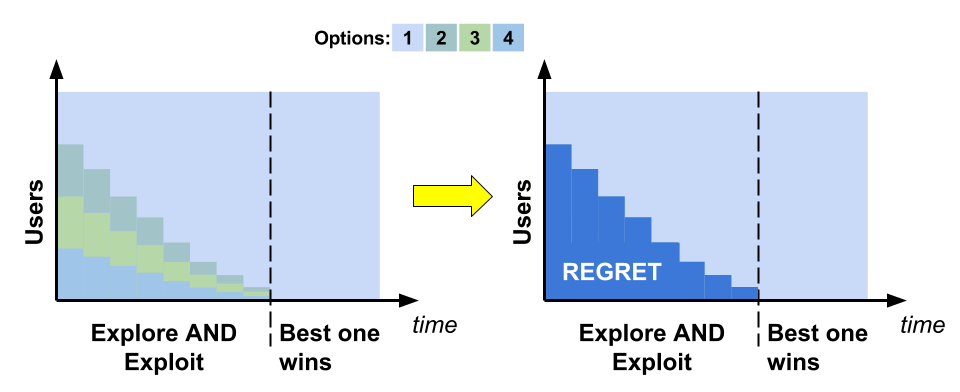
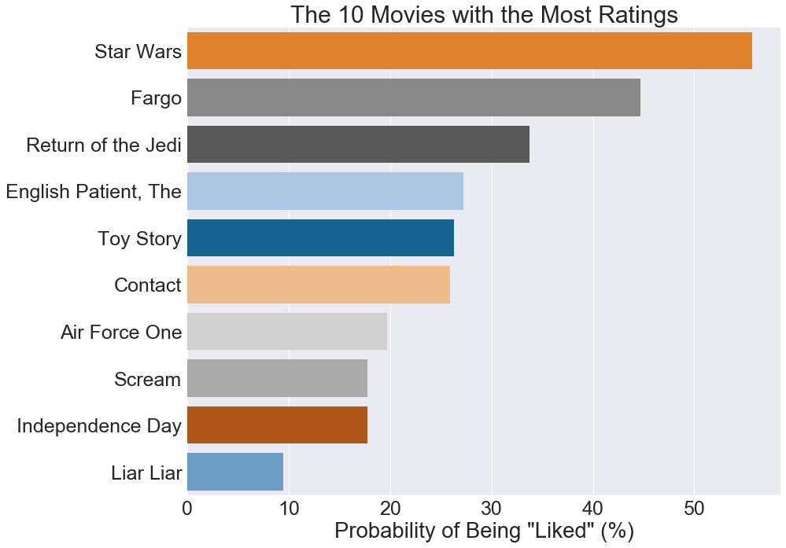
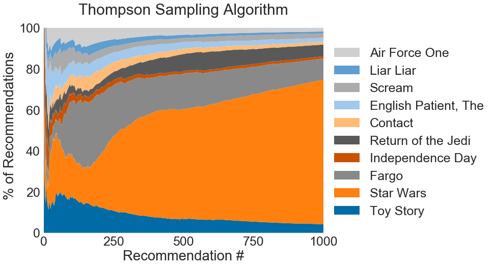
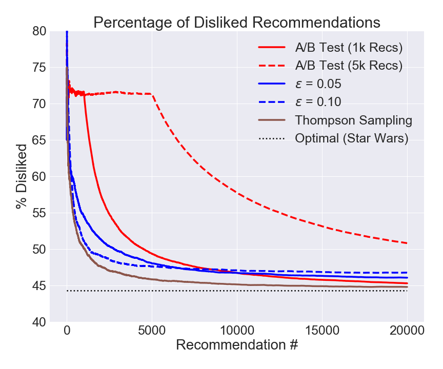

# No Regrets
*A deep dive comparison of bandits and A/B testing*

##### Table of Contents
- [Background and Introduction](#background-and-introduction)
	- [A/B Tests](#ab-tests)
	- [Bandit Algorithms](#bandit-algorithms)
- [Finding the Best Movie](#finding-the-best-movie)
	- [Replay for Online Tests](#replay-for-online-tests)
	- [Movie Ratings Data](#movie-ratings-data)
- [Results](#results)
	- [Bandit Simulation Results](#bandit-simulation-results)
	- [Overall Results](#overall-results)
- [Summary](#summary)

## Background and Introduction
### A/B Tests
A standard approach for evaluating the performance of various choices in an online setting is A/B testing. As the name implies, the technique is an experiment to determine the performance of two options, "A" and "B," where option "A" generally represents what is currently in use and it acts as a control to compare to choice "B." In a real setting, there can be any number of alternative options under test, for example, a few different advertisement banners or formatting styles of a web page. During the test, each option is presented to an equal number of users to **explore** the options; after the test concludes and the best option has been identified, the best option is used thereafter, **exploiting** the knowledge that was gained during the test.

  

One drawback with A/B testing is that it incurs "**regret**," which is the concept that during the test, inferior options were presented to users who may have had a better interaction with a better choice. For example, imagine performing an A/B test to compare different advertisement banners and that after the test, it is clear that one ad generally resulted in more users clicking on it than the other ads. In this case, the users who were shown one of the inferior ads may not have clicked on the ad that they were shown, but had they seen the best option, they might have.

### Bandit Algorithms
Bandit algorithms can reduce the amount of regret that is experienced by A/B tests, because they dynamically balance exploration with exploitation: after every new sample, the knowledge that was learned is used to make a better choice the next time around. Over time, the options that perform better are used more often at the expense of the underperforming ones, and eventually the best option wins out.

  

How this dynamic balance of exploration and exploitation is achieved is dependent on the particular bandit algorithm. One of the first bandit algorithms that was developed is the &epsilon;-Greedy algorithm, which uses a parameter ("&epsilon;") to control the percentage of time that a random option is selected &mdash; corresponding to exploration. The remainder of the time, the option that has historically performed the best is used &mdash; corresponding to exploitation.

The Thompson Sampling algorithm is a bandit that treats each option under test as having an intrinsic probability of resulting in a positive user interaction. To select which option to present to a user, each option's probability distribution is sampled and the one with the highest probability of having a positive interaction is used.

There are other bandit algorithms as well, such as the Soft Max algorithm, which can be used to minimize negative interactions, at the cost of using the best option less often. Choosing which bandit algorithm to use depends on the specific circumstances and the priorities of the person or organization doing the test. 

## Finding the Best Movie
Common uses of bandit algorithms include advertisement banners and news article suggestions. In principle, however, bandits can be used in any situation where there are a number of choices, each of which has a  different rate of positive user interaction.

When a person watches a movie, she might enjoy the experience or she might not. From this viewpoint, bandit algorithms could be used to identify the "best" movie out of a collection of movies. In this context, the algorithm would be making a recommendation to a potential viewer, and if the person watched and enjoyed the movie, that would be a positive interaction.

### Replay for Online Tests
Bandit algorithms are generally used online, but they can be simulated on historical data using a method known as the "replayer" method. This works by simulating which option the algorithm would select for a viewer, and if there is a historical record of the viewer's interaction with that option, the result &mdash; whether the experience was positive or negative &mdash; is counted as if it had happened. If there is no historical record of that interaction, it is ignored. Using the replayer method, bandit algorithms can be used on a historical dataset of movie ratings. 

### Movie Ratings Data
The MovieLens 100K dataset contains 943 users and their ratings for 1,682 movies. The ratings, however, are on a scale from 1 (worst) to 5 (best). To translate this discrete range into a simple positive or negative experience for the viewer, a rating threshold can be chosen to delineate whether the viewer "liked" or "disliked" the movie. Since a rating of 5 is the best, it is clear that those who gave that rating liked the movie, so that is an obvious choice for the threshold: if a viewer gave a movie a rating of 5, the user "liked" the movie; otherwise, the user "disliked" the movie.

The movies in the dataset do not have the same number of ratings. As a consequence, a longer testing period would be needed to identify the best movie, given the constraints of the replayer method. In the interests of having a denser data set, the simulations can be limited to the ten movies with the most ratings. These movies are summarized in the following figure, which shows the probability &mdash; based on the historical data &mdash; that a viewer liked the movie and gave it a rating of 5.

  

For example, the original *Star Wars* movie was liked by more than 50% of the viewers who rated it, whereas *Liar Liar* was liked by less than 10%. If the bandit simulation works correctly, it should determine that *Star Wars* is the best movie in the set.

## Results
### Bandit Simulation Results
As discussed earlier, bandit algorithms dynamically balance exploration and exploitation. They start out using all possible options, but continuously shift towards choosing the better options more often until one prevails as the best.

The following figure summarizes the first 1,000 recommendations made during a single simulation of a Thompson Sampling bandit on the movie dataset. The figure shows each movie's percentage of the total recommendations made on the vertical axis, as a function of how many recommendations the algorithm made at that moment on the horizontal axis.

  

It is clear that in the beginning of the simulation, all options are being explored, but over time the best one emerges. Of the first 250 recommendations:
- 27 (~11%) were *Toy Story*
- 91 (~36%) were *Star Wars*
- 63 (~25%) were *Fargo*

After 500 recommendations, *Star Wars* has already accounted for more than 50% of all of the recommendations made by the algorithm; after 1,000 recommendations, its share has surpassed 70%.

### Overall Results
The simulation results for 20,000 recommendations made by three different algorithms (Thompson Sampling, &epsilon;-Greedy and A/B tests) are compared in the following figure. The percentage of recommendations that resulted in the viewer **dis**liking the recommendation is shown in the vertical dimension, as a function of total recommendations made by the algorithm on the horizontal. The best movie to recommend is *Star Wars*, which was liked by ~56% of the viewers who rated it and disliked by 44%; this is shown as a dotted black line in the figure.

The A/B tests were simulated for two different test period lengths (1,000 and 5,000 recommendations), after which the movie choice that was determined to be the best was recommended for the remainder of the simulation. The &epsilon;-Greedy algorithm was simulated with two different values of the parameter &epsilon; (0.05 and 0.10). All of the simulations were averaged over 20 iterations.

  

The A/B tests (red) demonstrate an average performance during their testing periods and only after the tests have concluded do they show improvement. This makes sense because all ten movies are recommended in equal portions during the testing phase. After the test concludes and *Star Wars* has been identified as the best option, it begins to recommend *Star Wars* 100% of the time, so the percentage of disliked recommendations begins to approach the optimal value.

The &epsilon;-Greedy results (blue) are significantly better than the longer A/B test, and better in the short-term than the shorter A/B test. Between the two &epsilon;-Greedy simulations, one (dashed line) performs better in the short-term while the other shows better performance in the long-term.

The Thompson Sampling results (brown) are the best of them all, demonstrating fast convergence and rapidly approach the optimal value.

## Summary
From the simulations of movie recommendations, it is clear that the bandit algorithms can reduce regret: the percentage of negative outcomes &mdash; i.e., disliked recommendations &mdash; are generally less than the A/B tests.

There are different bandit algorithms for different situations, and depending on the circumstances and the specific needs at hand, it may be better to use a bandit that converges faster, or one that operates more slowly but results in better performance long-term. A/B tests are still a valuable tool, however: since the bandit algorithms reduce the usage of inferior options, it takes longer to establish statistical significance of their performance, which could be an important consideration.